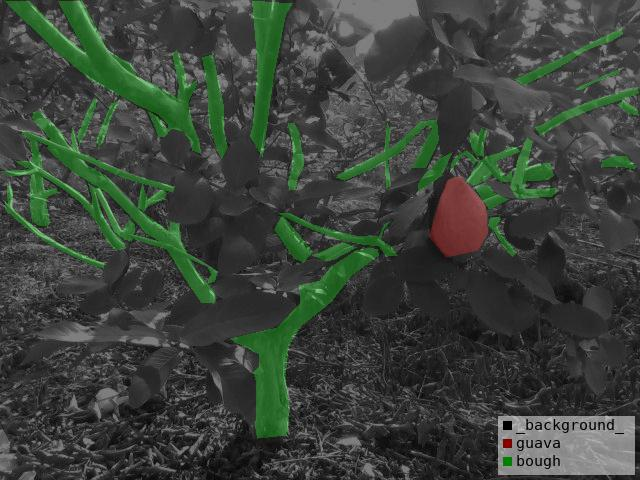
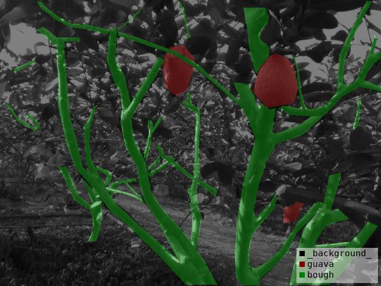

# guava-dataset
The guava-dataset is released to promote the development of agricultural robots

## Introduction
A guava-dataset is released to promote the development of robotic tea harvesting. It contains 891 RGB images captured by a RealSense D435i camera, and is created in the VOC format. Each image is manually annotated by LabelMe.

## Download
The guava-dataset can be download here.

Link: https://pan.baidu.com/s/1uw2POc4u7LZhn_A1vxLucA 
Link: 4wos

## Examples
Some visual exmaples are given below.





## Cite guava-dataset
If you use guava-dataset in your research, please cite our work by using the following entry:

```latex
 @article{
  title = {Efficient detection and picking sequence planning of tea buds in a high-density canopy},
  journal = {Computers and Electronics in Agriculture},
  volume = {213},
  pages = {108213},
  year = {2023},
  issn = {0168-1699},
  doi = {https://doi.org/10.1016/j.compag.2023.108213},
  url = {https://www.sciencedirect.com/science/article/pii/S0168169923006014},
  author = {Guichao Lin and Juntao Xiong and Runmao Zhao and Xiaomin Li and Hongnan Hu and Lixue Zhu and Rihong Zhang}
}
```
